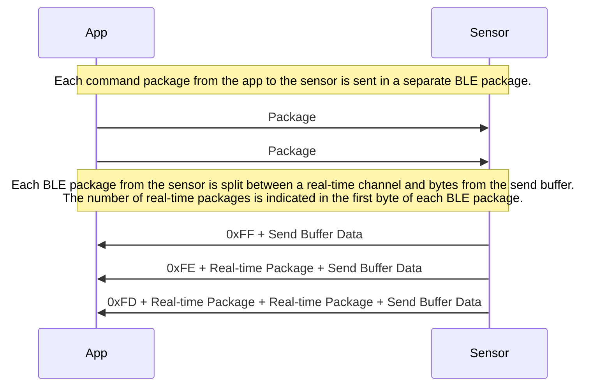
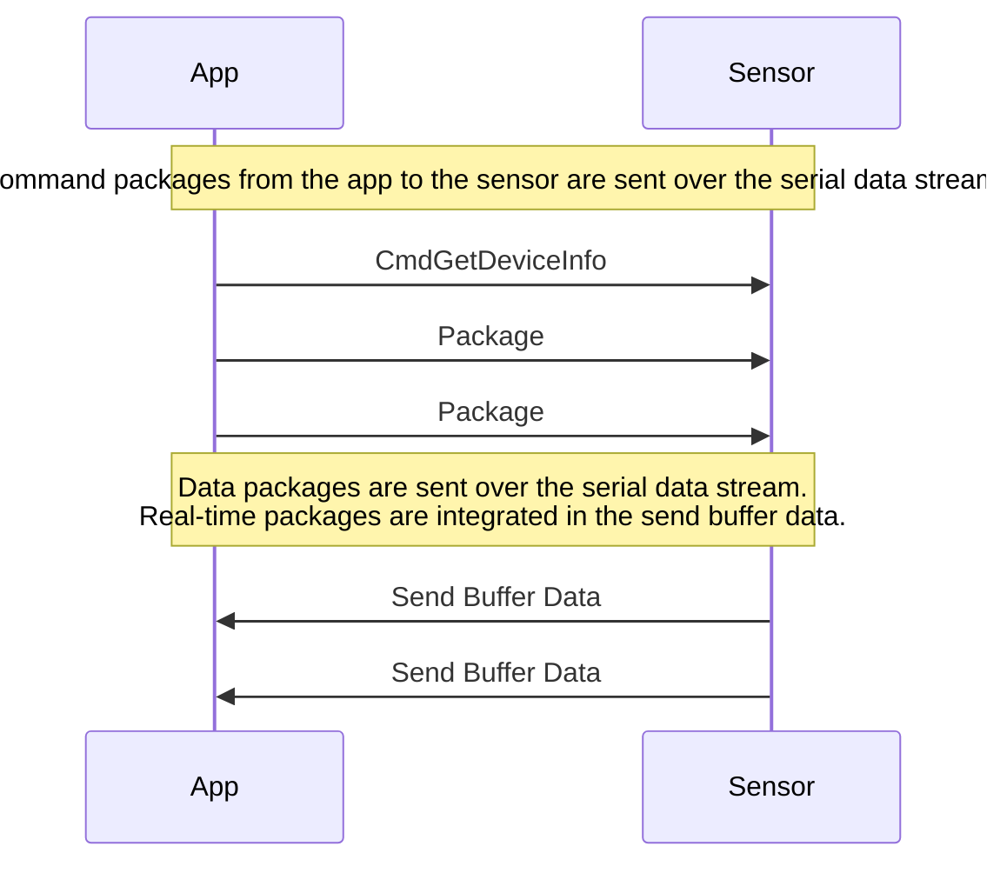
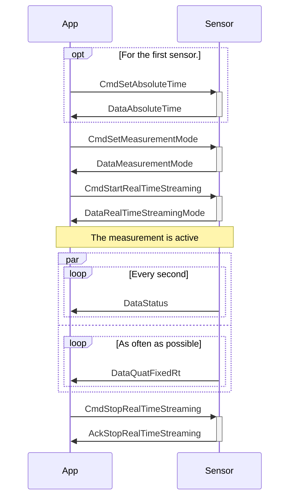
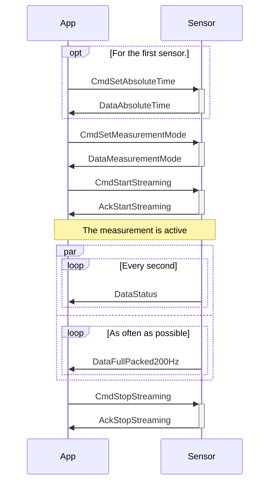
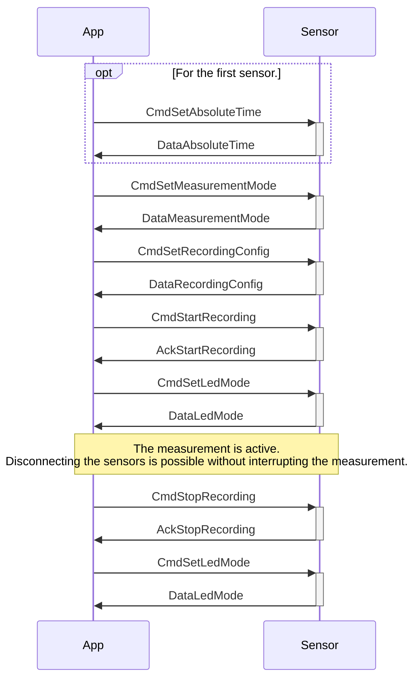
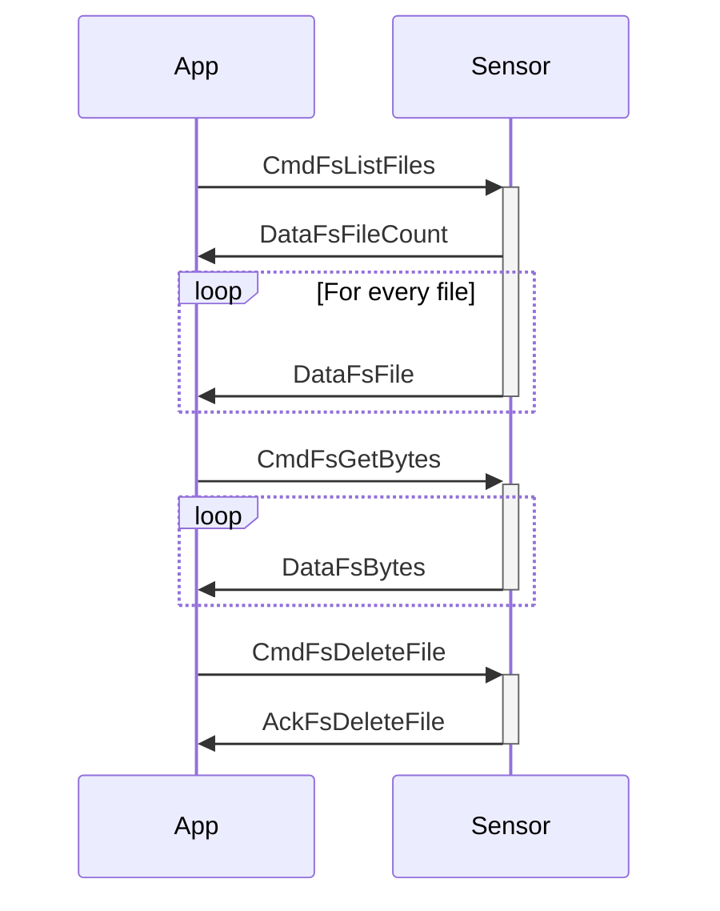

# Capture2Go Communication Protocol
<!--
SPDX-FileCopyrightText: 2025 SensorStim Neurotechnology GmbH <support@capture2go.com>

SPDX-License-Identifier: MIT
-->

## Table of Contents

1. [Introduction](#introduction)
2. [Data Package Format](#data-package-format)
3. [BLE Communication](#ble-communication)
4. [USB Communication](#usb-communication)
5. [Decoding of Fixed-Point Data](#usb-communication)
6. [Error Flags](#error-flags)
7. [Examples](#examples)
8. [Specification of Commands and Data Packages](#specification-of-commands-and-data-packages)

## Introduction

This document describes the communication protocol and binary data storage format of the Capture2Go IMU. This document is aimed at developers who want to communicate with the sensor without using the SDK, e.g., using a programming language other than Python. In most use cases, using the mobile measurement app will be sufficient, and consulting this document is not necessary.

Note that the Python SDK already includes code for communicating with the sensors and parsing the data packages. Still, this document is useful for developers who use the Python SDK in an advanced way that goes beyond the provided [examples](../examples/).

## Data Package Format

All communication to and from the sensor, as well as the stored binary measurement files, are sequences of packages. Each package is represented in the following frame:

### SensorSerialPackage

Package frame including header, payload size, and checksum.
| Field         | Type                                        | Comment                                            |
| ------------- | ------------------------------------------- | -------------------------------------------------- |
| `startByte`   | uint8                                       | Fixed 0x02 byte.                                   |
| `crc32`       | uint32                                      | Checksum calculated over `header` and `payload`.   |
| `payloadSize` | uint8                                       | Size of `payload`, between 0 and 236.              |
| `header`      | [SensorHeader](#enum-sensorheader) (16 bit) | Value that identifies the command or data package. |
| `payload`     | uint8[236]                                  | Variable-length payload, between 0 and 236 bytes.  |

**Size**: 1 + 4 + 1 + 2 + 236 = 244 bytes

First, each package consists of a start byte with the value 0x02, which can be used to seek for the start of a package in case of lost data or other errors.

The checksum is calculated over the `header` and the `payload` fields. A standard CRC32 checksum is used and implementations are available in many libraries (e.g., [`zlib.crc32`](https://docs.python.org/3/library/zlib.html#zlib.crc32) in Python).

The `header` field indicates the command or the data represented by the package. While some packages do not have any `payload`, many package headers are associated with a specific package content. Those packages are defined below, see [DataFullPacked](#package-datafullpacked) for one example.

In C/C++, both the [SensorSerialPackage](#sensorserialpackage) framing package and the individual data packages can be represented as packed structs, with fields concatenated without any padding. In the Python SDK, the package definitions described in this document can be found in the file `pkg.py`.

## BLE Communication

To scan for IMUs, filter using the service UUID `80030001-e629-4c98-9324-aa7fc0c66de7`. Connect to the device and activate notifications for the TX GATT characteristic `80030003-e629-4c98-9324-aa7fc0c66de7`. Send data to the sensor by writing to the RX GATT characteristic `80030002-e629-4c98-9324-aa7fc0c66de7`.

Each send operation to the RX characteristic should be one full [SensorSerialPackage](#sensorserialpackage), including the start byte 0x02, and containing a correct CRC.

The data received from the sensor via the TX characteristic is split into two data streams: real-time packages and packages from the send buffer. For each received BLE package, the first byte indicates the number of real-time packages. 0xFF indicates 0 real-time packages, 0xFE indicates 1 real-time package, 0xFD indicates 2 real-time packages, and so on.

To maximize BLE package size and therefore the throughput, the remaining content of the BLE package is filled with bytes from the send buffer. The send buffer contains all packages not sent via the real-time stream. Note that it is not guaranteed that one BLE package contains only complete [SensorSerialPackage](#sensorserialpackage)s. Bytes received from multiple BLE packages must be collected until a complete [SensorSerialPackage](#sensorserialpackage) is available. See the `Unpacker` class in the SDK for an example implementation for how to unpack this data stream.



## USB Communication

Communication with the sensor is also possible via USB. The sensor emulates a serial port which can be used using standard libraries such as [pySerial](https://pypi.org/project/pyserial/).

Communication in both directions is byte-based. To send a message to the sensor, write a complete [SensorSerialPackage](#sensorserialpackage) to the serial port. To read data, collect the incoming bytes until they contain a full [SensorSerialPackage](#sensorserialpackage).

To start communication with the device, you first must send a [CmdGetDeviceInfo](#packages-without-payload) package.

Unlike in [BLE Communication](#ble-communication), there is no separate real-time data stream. Real-time data packages are interleaved with regular packages in the send buffer data stream.



## Decoding of Fixed-Point Data

In many data packages, values are represented as signed 16-bit integers. To convert those values into floating point values with a well-defined unit, multiply them with the following scaling factors:

| Name                  | Value                        | Unit  |
| --------------------- | ---------------------------- | ----- |
| GYR_SCALE_FACTOR      | 2000.0 * π / 180.0 / 32768.0 | rad/s |
| ACC_SCALE_FACTOR      | 16.0 / 32768.0 * 9.81        | m/s²  |
| MAG_SCALE_FACTOR      | 1.0 / 16.0                   | μT    |
| DELTA_SCALE_FACTOR    | π / 32768.0                  | rad   |
| GYR_BIAS_SCALE_FACTOR | 2.0 * π / 180.0 / 32768.0    | rad/s |

In many cases, orientation quaternions are represented as 64-bit integers.

This fixed-point representation uses a "smallest three" scheme, in which the three smallest components are each encoded as a 20-bit fixed-point number. Two bits are used to indicate which of the four components has been omitted. The remaining two bits are used to indicate whether the orientation estimation algorithm detected that the sensor is at rest and whether it detected magnetic disturbances.

This representation can be decoded into a quaternion and the two boolean flags as follows:

```cpp
void decodeQuat(uint64_t quat, double out[4], bool *outRest, bool *outMagDist)
{
    *outRest = (quat >> 62) & 1;
    *outMagDist = (quat >> 63) & 1;
    int ax = (quat >> 60) & 3;
    double sqSum = 0;
    for (int i = 3; i > 0; i--) {
        double val = double(quat & 0xFFFFF) / double(0xFFFFF / M_SQRT2) - double(M_SQRT1_2);
        sqSum += val*val;
        out[(ax+i) % 4] = val;
        quat >>= 20;
    }
    out[ax] = sqrt(1-sqSum);
}
```

For a Python implementation, see `decodeQuat` in the SDK.

In order to obtain orientations in other representations such as Euler angles, convert the quaternion to the desired representation, e.g., using the `eulerAngles` function in the SDK.

## Error Flags

The IMU data packages contain an `errorFlags` field. The value is a bitwise OR combination of the following flags:


| Name             | Value     | Comment                                                 |
| ---------------- | --------- | ------------------------------------------------------- |
| TIME_GAP         | 0x01 (1)  | Indicates irregularities in the package timestamp.      |
| GYR_CLIPPING     | 0x02 (2)  | Indicates clipping in the gyroscope measurement.        |
| ACC_CLIPPING     | 0x04 (4)  | Indicates clipping in the accelerometer measurement.    |
| MAG_CLIPPING     | 0x08 (8)  | Indicates clipping in the magnetometer measurement.     |
| PROCESSING_ISSUE | 0x10 (16) | Indicates issues in the on-chip sensor data processing. |

**Notes:**

- A time gap might occur when setting the clock during the measurement or due to issues with synchronization or data processing.
- The clipping flags indicate clipping in the original sample before on-chip data processing. Clipping is more likely in the high-frequency gyroscope and accelerometer samples at 1666 Hz. Short phases of clipping that do not appear in the processed output data might not be relevant.
- The processing issue error flag indicates a severe error in the on-chip data processing that will most likely affect the measured data.

## Examples

The following section provides sequence diagrams for common scenarios to explain how communication between the sensor and app works. Note that those are only a limited selection of specific use cases. Together with the full protocol specification, these scenarios are intended as starting points for custom use cases. In addition to the explanations provided here, also take a look at the [example code](../examples/) provided with the SDK.

### Real-time Streaming of Orientations

The first example demonstrates obtaining orientation data from one or more sensors in real time.



**Notes:**

- In [CmdStartRealTimeStreaming](#packages-without-payload), set the mode to [RealTimeDataMode](#enum-realtimedatamode).`REAL_TIME_DATA_QUAT`. Whenever a BLE package can be sent, the most recent orientation is sent via the real-time channel.
- As an acknowledgment for the [CmdSetAbsoluteTime](#package-dataabsolutetime) and [CmdSetMeasurementMode](#package-datameasurementmode) commands, the same data is set back in a [DataAbsoluteTime](#package-dataabsolutetime) and [DataMeasurementMode](#package-datameasurementmode) package, respectively. The same principle applies to many other packages.
- To measure data from multiple sensors synchronously:
  - Set [CmdSetMeasurementMode](#package-datameasurementmode).`syncMode` to [SyncMode](#enum-syncmode).`SYNC_SENDER` for the first sensor and to [SyncMode](#enum-syncmode).`SYNC_RECEIVER` for all other sensors.
  - Generate a random 64-bit integer and set this as [CmdSetMeasurementMode](#package-datameasurementmode).`syncId` for all sensors. Using a new random number for every measurement ensures that there is no interference with other nearby sensors.
  - For the first sensor, send [CmdSetAbsoluteTime](#package-dataabsolutetime) to the first sensor. The timestamp is a 64-bit unsigned integer with nanosecond resolution. It is recommended to use Unix timestamps, e.g., as obtained with `time.time_ns()` in Python. Note that the other sensors will automatically receive the time from the sync sender and therefore setting the time is not necessary.
  - The timestamp found in [DataQuatFixedRt](#package-dataquatfixed) (and many other packages) is then the absolute, synchronized time.


### Streaming of Full Data

The next example demonstrates measuring raw IMU data and orientations from one or more sensors at 200 Hz.



**Notes:**

- In [CmdSetMeasurementMode](#package-datameasurementmode), set `dataPackedMode` to [SamplingMode](#enum-samplingmode).`MODE_200HZ`. This generates full data packages with a sampling frequency of 200 Hz. Since each package contains 8 samples, the frequency at which packages are generated is 25 Hz.
- The measurement data will be collected in a buffer and sent to the app in a first-in-first-out manner. This ensures that the received data is sampled at regular intervals without gaps. However, periods of bad reception might lead to a significant delay while data from the sent buffer is cleared. To reduce the required bandwidth, consider using the "packed" data variants (i.e., [DataQuatPacked](#package-dataquatpacked) [DataFullPacked](#package-datafullpacked)), which bundle multiple samples in one package and are therefore more efficient.

### Offline Measurement (Recording) of Full Data

The third example demonstrates lossless recording of raw IMU data and orientations at 200 Hz. Since real-time transfer during the recording is not required, data is stored on the sensor and transferred after the measurement is complete.

**Measurement:**



**Data transfer:**



**Notes:**

- In [CmdSetMeasurementMode](#package-datameasurementmode), set `fullPackedMode` to [SamplingMode](#enum-samplingmode).`MODE_200HZ`.
- In [CmdSetRecordingConfig](#package-datarecordingconfig), make sure to use a `filename` that does not exist yet on the sensor (e.g., by using the current date and time).
- Optionally, use [CmdSetLedMode](#package-dataledmode) to flash the LED white to indicate the start and end of the recording.
- To measure data from multiple sensors synchronously, consider the notes from the real-time streaming example above and set [CmdSetMeasurementMode](#package-datameasurementmode).`syncMode` and  [CmdSetMeasurementMode](#package-datameasurementmode).`syncId` accordingly.
- It is possible to combine the recording of sensor data to a file with real-time streaming. This can be used for a real-time preview or to build feedback applications that use the data in real time while storing high-frequency measurements in a file on the sensor for later evaluation.
- Note that it is also possible to start the file transfer while the measurement is still running. This reduces or eliminates the waiting time after the measurement is complete. If this is required, consider using the Android/iOS app, which also provides many other useful features.

## Specification of Commands and Data Packages


### Enum SensorHeader

| Name                                    | Value          | Comment                                                                                                                                                                                                                                                                                                                                      |
| --------------------------------------- | -------------- | -------------------------------------------------------------------------------------------------------------------------------------------------------------------------------------------------------------------------------------------------------------------------------------------------------------------------------------------- |
| CMD_GET_DEVICE_INFO                     | 0x0070 (112)   | Requests device information. ([CmdGetDeviceInfo](#packages-without-payload), response: [DataDeviceInfo](#package-datadeviceinfo))                                                                                                                                                                                                            |
| DATA_DEVICE_INFO                        | 0x0071 (113)   | Device information. ([DataDeviceInfo](#package-datadeviceinfo))                                                                                                                                                                                                                                                                              |
|                                         |                |                                                                                                                                                                                                                                                                                                                                              |
| _RESERVED01                             | 0x00A0 (160)   | Reserved for internal use.                                                                                                                                                                                                                                                                                                                   |
| _RESERVED02                             | 0x00A1 (161)   | Reserved for internal use.                                                                                                                                                                                                                                                                                                                   |
| _RESERVED03                             | 0x0103 (259)   | Reserved for internal use.                                                                                                                                                                                                                                                                                                                   |
| _RESERVED04                             | 0x0104 (260)   | Reserved for internal use.                                                                                                                                                                                                                                                                                                                   |
| _RESERVED05                             | 0x0105 (261)   | Reserved for internal use.                                                                                                                                                                                                                                                                                                                   |
| _RESERVED06                             | 0x0106 (262)   | Reserved for internal use.                                                                                                                                                                                                                                                                                                                   |
| **Sleep and deep sleep**                |                |                                                                                                                                                                                                                                                                                                                                              |
| CMD_SLEEP                               | 0x0110 (272)   | Puts device into sleep mode. ([CmdSleep](#packages-without-payload), response: [AckSleep](#packages-without-payload))                                                                                                                                                                                                                        |
| ACK_SLEEP                               | 0x0111 (273)   | Acknowledges sleep command. ([AckSleep](#packages-without-payload))                                                                                                                                                                                                                                                                          |
| CMD_DEEP_SLEEP                          | 0x0112 (274)   | Puts device into deep sleep mode (transport mode). ([CmdDeepSleep](#packages-without-payload), response: [AckDeepSleep](#packages-without-payload))                                                                                                                                                                                          |
| ACK_DEEP_SLEEP                          | 0x0113 (275)   | Acknowledges deep sleep command. ([AckDeepSleep](#packages-without-payload))                                                                                                                                                                                                                                                                 |
| **Main measurement configuration**      |                |                                                                                                                                                                                                                                                                                                                                              |
| CMD_SET_MEASUREMENT_MODE                | 0x0120 (288)   | Sets measurement mode. ([CmdSetMeasurementMode](#package-datameasurementmode), response: [DataMeasurementMode](#package-datameasurementmode))                                                                                                                                                                                                |
| CMD_GET_MEASUREMENT_MODE                | 0x0121 (289)   | Requests measurement mode. ([CmdGetMeasurementMode](#packages-without-payload), response: [DataMeasurementMode](#package-datameasurementmode))                                                                                                                                                                                               |
| DATA_MEASUREMENT_MODE                   | 0x0122 (290)   | Measurement mode. ([DataMeasurementMode](#package-datameasurementmode))                                                                                                                                                                                                                                                                      |
| **Burst measurement**                   |                |                                                                                                                                                                                                                                                                                                                                              |
| CMD_SET_MEASUREMENT_BURST_MODE          | 0x0123 (291)   | Sets measurement burst mode. ([CmdSetMeasurementBurstMode](#package-datameasurementburstmode), response: [DataMeasurementBurstMode](#package-datameasurementburstmode))                                                                                                                                                                      |
| CMD_GET_MEASUREMENT_BURST_MODE          | 0x0124 (292)   | Requests measurement burst mode. ([CmdGetMeasurementBurstMode](#packages-without-payload), response: [DataMeasurementBurstMode](#package-datameasurementburstmode))                                                                                                                                                                          |
| DATA_MEASUREMENT_BURST_MODE             | 0x0125 (293)   | Measurement burst mode. ([DataMeasurementBurstMode](#package-datameasurementburstmode))                                                                                                                                                                                                                                                      |
|                                         |                |                                                                                                                                                                                                                                                                                                                                              |
| _RESERVED07                             | 0x0130 (304)   | Reserved for internal use.                                                                                                                                                                                                                                                                                                                   |
| _RESERVED08                             | 0x0131 (305)   | Reserved for internal use.                                                                                                                                                                                                                                                                                                                   |
| _RESERVED09                             | 0x0132 (306)   | Reserved for internal use.                                                                                                                                                                                                                                                                                                                   |
| **Recording configuration**             |                |                                                                                                                                                                                                                                                                                                                                              |
| CMD_SET_RECORDING_CONFIG                | 0x0140 (320)   | Sets recording configuration. ([CmdSetRecordingConfig](#package-datarecordingconfig), response: [DataRecordingConfig](#package-datarecordingconfig))                                                                                                                                                                                         |
| CMD_GET_RECORDING_CONFIG                | 0x0141 (321)   | Requests recording configuration. ([CmdGetRecordingConfig](#packages-without-payload), response: [DataRecordingConfig](#package-datarecordingconfig))                                                                                                                                                                                        |
| DATA_RECORDING_CONFIG                   | 0x0142 (322)   | Recording configuration. ([DataRecordingConfig](#package-datarecordingconfig))                                                                                                                                                                                                                                                               |
| **Start and stop measurement**          |                |                                                                                                                                                                                                                                                                                                                                              |
| CMD_START_STREAMING                     | 0x0150 (336)   | Starts data streaming. ([CmdStartStreaming](#packages-without-payload))                                                                                                                                                                                                                                                                      |
| ACK_START_STREAMING                     | 0x0151 (337)   | Acknowledges start streaming command. ([AckStartStreaming](#packages-without-payload))                                                                                                                                                                                                                                                       |
| CMD_STOP_STREAMING                      | 0x0152 (338)   | Stops data streaming. ([CmdStopStreaming](#packages-without-payload), response: [AckStopStreaming](#packages-without-payload))                                                                                                                                                                                                               |
| ACK_STOP_STREAMING                      | 0x0153 (339)   | Acknowledges stop streaming command. ([AckStopStreaming](#packages-without-payload))                                                                                                                                                                                                                                                         |
| CMD_START_RECORDING                     | 0x0154 (340)   | Starts recording data to internal storage. ([CmdStartRecording](#packages-without-payload), response: [AckStartRecording](#packages-without-payload))                                                                                                                                                                                        |
| ACK_START_RECORDING                     | 0x0155 (341)   | Acknowledges start recording command. ([AckStartRecording](#packages-without-payload))                                                                                                                                                                                                                                                       |
| CMD_STOP_RECORDING                      | 0x0156 (342)   | Stops data recording. ([CmdStopRecording](#packages-without-payload), response: [AckStopRecording](#packages-without-payload))                                                                                                                                                                                                               |
| ACK_STOP_RECORDING                      | 0x0157 (343)   | Acknowledges stop recording command. ([AckStopRecording](#packages-without-payload))                                                                                                                                                                                                                                                         |
| CMD_STOP_STREAMING_AND_CLEAR_BUFFER     | 0x0158 (344)   | Stops streaming and clears the send buffer. Used after connecting to a sensor in streaming mode. Note: Clearing the buffer can cause partial packages to be sent, which must be handled when unpacking. ([CmdStopStreamingAndClearBuffer](#packages-without-payload), response: [AckStopStreamingAndClearBuffer](#packages-without-payload)) |
| ACK_STOP_STREAMING_AND_CLEAR_BUFFER     | 0x0159 (345)   | Acknowledges stop streaming and clear buffer command. ([AckStopStreamingAndClearBuffer](#packages-without-payload))                                                                                                                                                                                                                          |
| **Streaming via the real-time channel** |                |                                                                                                                                                                                                                                                                                                                                              |
| CMD_START_REAL_TIME_STREAMING           | 0x0160 (352)   | Starts real-time data streaming via dedicated channel. ([CmdStartRealTimeStreaming](#package-datarealtimestreamingmode), response: [DataRealTimeStreamingMode](#package-datarealtimestreamingmode))                                                                                                                                          |
| CMD_GET_REAL_TIME_STREAMING_MODE        | 0x0161 (353)   | Requests current real-time streaming mode. ([CmdGetRealTimeStreamingMode](#packages-without-payload), response: [DataRealTimeStreamingMode](#package-datarealtimestreamingmode))                                                                                                                                                             |
| DATA_REAL_TIME_STREAMING_MODE           | 0x0162 (354)   | Real-time streaming mode. ([DataRealTimeStreamingMode](#package-datarealtimestreamingmode))                                                                                                                                                                                                                                                  |
| CMD_STOP_REAL_TIME_STREAMING            | 0x0163 (355)   | Stops real-time data streaming. ([CmdStopRealTimeStreaming](#packages-without-payload), response: [AckStopRealTimeStreaming](#packages-without-payload))                                                                                                                                                                                     |
| ACK_STOP_REAL_TIME_STREAMING            | 0x0164 (356)   | Acknowledges stop real-time streaming command. ([AckStopRealTimeStreaming](#packages-without-payload))                                                                                                                                                                                                                                       |
| **Clock**                               |                |                                                                                                                                                                                                                                                                                                                                              |
| CMD_SET_ABSOLUTE_TIME                   | 0x0170 (368)   | Sets the absolute time on the device. Sent from host to sync sender. ([CmdSetAbsoluteTime](#package-dataabsolutetime), response: [DataAbsoluteTime](#package-dataabsolutetime))                                                                                                                                                              |
| DATA_ABSOLUTE_TIME                      | 0x0171 (369)   | Absolute time. ([DataAbsoluteTime](#package-dataabsolutetime))                                                                                                                                                                                                                                                                               |
| DATA_CLOCK_ROUNDTRIP                    | 0x0172 (370)   | Clock roundtrip package for clock drift estimation. ([DataClockRoundtrip](#package-dataclockroundtrip))                                                                                                                                                                                                                                      |
| **LED**                                 |                |                                                                                                                                                                                                                                                                                                                                              |
| CMD_SET_LED_CONFIG                      | 0x0180 (384)   | Sets LED configuration parameters. ([CmdSetLedConfig](#package-dataledconfig), response: [DataLedConfig](#package-dataledconfig))                                                                                                                                                                                                            |
| CMD_GET_LED_CONFIG                      | 0x0181 (385)   | Requests LED configuration parameters. ([CmdGetLedConfig](#packages-without-payload), response: [DataLedConfig](#package-dataledconfig))                                                                                                                                                                                                     |
| DATA_LED_CONFIG                         | 0x0182 (386)   | LED configuration parameters. ([DataLedConfig](#package-dataledconfig))                                                                                                                                                                                                                                                                      |
| CMD_SET_LED_MODE                        | 0x0183 (387)   | Sets LED mode. ([CmdSetLedMode](#package-dataledmode), response: [DataLedMode](#package-dataledmode))                                                                                                                                                                                                                                        |
| CMD_GET_LED_MODE                        | 0x0184 (388)   | Requests LED mode. ([CmdGetLedMode](#packages-without-payload), response: [DataLedMode](#package-dataledmode))                                                                                                                                                                                                                               |
| DATA_LED_MODE                           | 0x0185 (389)   | LED mode. ([DataLedMode](#package-dataledmode))                                                                                                                                                                                                                                                                                              |
| **Sync output**                         |                |                                                                                                                                                                                                                                                                                                                                              |
| CMD_SET_SYNC_OUTPUT_MODE                | 0x0186 (390)   | Configures a sync output pulse. ([CmdSetSyncOutputMode](#package-datasyncoutputmode), response: [DataSyncOutputMode](#package-datasyncoutputmode))                                                                                                                                                                                           |
| DATA_SYNC_OUTPUT_MODE                   | 0x0187 (391)   | Sync output pulse configuration. ([DataSyncOutputMode](#package-datasyncoutputmode))                                                                                                                                                                                                                                                         |
|                                         |                |                                                                                                                                                                                                                                                                                                                                              |
| _RESERVED10                             | 0x0190 (400)   | Reserved for internal use.                                                                                                                                                                                                                                                                                                                   |
| _RESERVED11                             | 0x0191 (401)   | Reserved for internal use.                                                                                                                                                                                                                                                                                                                   |
| _RESERVED12                             | 0x0192 (402)   | Reserved for internal use.                                                                                                                                                                                                                                                                                                                   |
| _RESERVED13                             | 0x0193 (403)   | Reserved for internal use.                                                                                                                                                                                                                                                                                                                   |
| _RESERVED14                             | 0x0194 (404)   | Reserved for internal use.                                                                                                                                                                                                                                                                                                                   |
| _RESERVED15                             | 0x0195 (405)   | Reserved for internal use.                                                                                                                                                                                                                                                                                                                   |
| **Status**                              |                |                                                                                                                                                                                                                                                                                                                                              |
| CMD_GET_STATUS                          | 0x0200 (512)   | Requests current device status information. ([CmdGetStatus](#packages-without-payload), response: [DataStatus](#package-datastatus))                                                                                                                                                                                                         |
| DATA_STATUS                             | 0x0201 (513)   | Device status. ([DataStatus](#package-datastatus))                                                                                                                                                                                                                                                                                           |
|                                         |                |                                                                                                                                                                                                                                                                                                                                              |
| _RESERVED16                             | 0x0210 (528)   | Reserved for internal use.                                                                                                                                                                                                                                                                                                                   |
| _RESERVED17                             | 0x0211 (529)   | Reserved for internal use.                                                                                                                                                                                                                                                                                                                   |
| _RESERVED18                             | 0x0212 (530)   | Reserved for internal use.                                                                                                                                                                                                                                                                                                                   |
| _RESERVED19                             | 0x0213 (531)   | Reserved for internal use.                                                                                                                                                                                                                                                                                                                   |
| _RESERVED20                             | 0x0214 (532)   | Reserved for internal use.                                                                                                                                                                                                                                                                                                                   |
| **Sensor data**                         |                |                                                                                                                                                                                                                                                                                                                                              |
| DATA_FULL_PACKED_200HZ                  | 0x0221 (545)   | Full IMU data at 200 Hz, 8 samples, packaged at 25 Hz (200/8 Hz). ([DataFullPacked200Hz](#package-datafullpacked))                                                                                                                                                                                                                           |
| DATA_FULL_PACKED_100HZ                  | 0x0222 (546)   | Full IMU data at 100 Hz, 8 samples, packaged at 12.5 Hz (100/8 Hz). ([DataFullPacked100Hz](#package-datafullpacked))                                                                                                                                                                                                                         |
| DATA_FULL_PACKED_50HZ                   | 0x0223 (547)   | Full IMU data at 50 Hz, 8 samples, packaged at 6.25 Hz (50/8 Hz). ([DataFullPacked50Hz](#package-datafullpacked))                                                                                                                                                                                                                            |
| DATA_FULL_PACKED_25HZ                   | 0x0224 (548)   | Full IMU data at 25 Hz, 8 samples, packaged at 3.125 Hz (25/8 Hz). ([DataFullPacked25Hz](#package-datafullpacked))                                                                                                                                                                                                                           |
| DATA_FULL_PACKED_10HZ                   | 0x0225 (549)   | Full IMU data at 10 Hz, 8 samples, packaged at 1.25 Hz (10/8 Hz). ([DataFullPacked10Hz](#package-datafullpacked))                                                                                                                                                                                                                            |
| DATA_FULL_PACKED_1HZ                    | 0x0226 (550)   | Full IMU data at 1 Hz, 8 samples, packaged at 0.125 Hz (1/8 Hz). ([DataFullPacked1Hz](#package-datafullpacked))                                                                                                                                                                                                                              |
|                                         |                |                                                                                                                                                                                                                                                                                                                                              |
| DATA_FULL_6D_PACKED_200HZ               | 0x0231 (561)   | IMU data without magnetometer at 200 Hz, 8 samples, packaged at 25 Hz (200/8 Hz). ([DataFull6DPacked200Hz](#package-datafull6dpacked))                                                                                                                                                                                                       |
| DATA_FULL_6D_PACKED_100HZ               | 0x0232 (562)   | IMU data without magnetometer at 100 Hz, 8 samples, packaged at 12.5 Hz (100/8 Hz). ([DataFull6DPacked100Hz](#package-datafull6dpacked))                                                                                                                                                                                                     |
| DATA_FULL_6D_PACKED_50HZ                | 0x0233 (563)   | IMU data without magnetometer at 50 Hz, 8 samples, packaged at 6.25 Hz (50/8 Hz). ([DataFull6DPacked50Hz](#package-datafull6dpacked))                                                                                                                                                                                                        |
| DATA_FULL_6D_PACKED_25HZ                | 0x0234 (564)   | IMU data without magnetometer at 25 Hz, 8 samples, packaged at 3.125 Hz (25/8 Hz). ([DataFull6DPacked25Hz](#package-datafull6dpacked))                                                                                                                                                                                                       |
| DATA_FULL_6D_PACKED_10HZ                | 0x0235 (565)   | IMU data without magnetometer at 10 Hz, 8 samples, packaged at 1.25 Hz (10/8 Hz). ([DataFull6DPacked10Hz](#package-datafull6dpacked))                                                                                                                                                                                                        |
| DATA_FULL_6D_PACKED_1HZ                 | 0x0236 (566)   | IMU data without magnetometer at 1 Hz, 8 samples, packaged at 0.125 Hz (1/8 Hz). ([DataFull6DPacked1Hz](#package-datafull6dpacked))                                                                                                                                                                                                          |
|                                         |                |                                                                                                                                                                                                                                                                                                                                              |
| DATA_FULL_FIXED_200HZ                   | 0x0241 (577)   | Full IMU data sample at 200 Hz, fixed-point format. ([DataFullFixed200Hz](#package-datafullfixed))                                                                                                                                                                                                                                           |
| DATA_FULL_FIXED_100HZ                   | 0x0242 (578)   | Full IMU data sample at 100 Hz, fixed-point format. ([DataFullFixed100Hz](#package-datafullfixed))                                                                                                                                                                                                                                           |
| DATA_FULL_FIXED_50HZ                    | 0x0243 (579)   | Full IMU data sample at 50 Hz, fixed-point format. ([DataFullFixed50Hz](#package-datafullfixed))                                                                                                                                                                                                                                             |
| DATA_FULL_FIXED_25HZ                    | 0x0244 (580)   | Full IMU data sample at 25 Hz, fixed-point format. ([DataFullFixed25Hz](#package-datafullfixed))                                                                                                                                                                                                                                             |
| DATA_FULL_FIXED_10HZ                    | 0x0245 (581)   | Full IMU data sample at 10 Hz, fixed-point format. ([DataFullFixed10Hz](#package-datafullfixed))                                                                                                                                                                                                                                             |
| DATA_FULL_FIXED_1HZ                     | 0x0246 (582)   | Full IMU data sample at 1 Hz, fixed-point format. ([DataFullFixed1Hz](#package-datafullfixed))                                                                                                                                                                                                                                               |
| DATA_FULL_FIXED_RT                      | 0x0247 (583)   | Full IMU data sample for real-time transmission, fixed-point format. ([DataFullFixedRt](#package-datafullfixed))                                                                                                                                                                                                                             |
|                                         |                |                                                                                                                                                                                                                                                                                                                                              |
| DATA_FULL_6D_FIXED_200HZ                | 0x0251 (593)   | IMU data sample without magnetometer at 200 Hz, fixed-point format. ([DataFull6DFixed200Hz](#package-datafull6dfixed))                                                                                                                                                                                                                       |
| DATA_FULL_6D_FIXED_100HZ                | 0x0252 (594)   | IMU data sample without magnetometer at 100 Hz, fixed-point format. ([DataFull6DFixed100Hz](#package-datafull6dfixed))                                                                                                                                                                                                                       |
| DATA_FULL_6D_FIXED_50HZ                 | 0x0253 (595)   | IMU data sample without magnetometer at 50 Hz, fixed-point format. ([DataFull6DFixed50Hz](#package-datafull6dfixed))                                                                                                                                                                                                                         |
| DATA_FULL_6D_FIXED_25HZ                 | 0x0254 (596)   | IMU data sample without magnetometer at 25 Hz, fixed-point format. ([DataFull6DFixed25Hz](#package-datafull6dfixed))                                                                                                                                                                                                                         |
| DATA_FULL_6D_FIXED_10HZ                 | 0x0255 (597)   | IMU data sample without magnetometer at 10 Hz, fixed-point format. ([DataFull6DFixed10Hz](#package-datafull6dfixed))                                                                                                                                                                                                                         |
| DATA_FULL_6D_FIXED_1HZ                  | 0x0256 (598)   | IMU data sample without magnetometer at 1 Hz, fixed-point format. ([DataFull6DFixed1Hz](#package-datafull6dfixed))                                                                                                                                                                                                                           |
|                                         |                |                                                                                                                                                                                                                                                                                                                                              |
| DATA_FULL_FLOAT_200HZ                   | 0x0261 (609)   | Full IMU data sample at 200 Hz, floating-point format. ([DataFullFloat200Hz](#package-datafullfloat200hz))                                                                                                                                                                                                                                   |
|                                         |                |                                                                                                                                                                                                                                                                                                                                              |
| DATA_QUAT_PACKED_200HZ                  | 0x0271 (625)   | Orientation data at 200 Hz, 20 samples, packaged at 10 Hz (200/20 Hz). ([DataQuatPacked200Hz](#package-dataquatpacked))                                                                                                                                                                                                                      |
| DATA_QUAT_PACKED_100HZ                  | 0x0272 (626)   | Orientation data at 100 Hz, 20 samples, packaged at 5 Hz (100/20 Hz). ([DataQuatPacked100Hz](#package-dataquatpacked))                                                                                                                                                                                                                       |
| DATA_QUAT_PACKED_50HZ                   | 0x0273 (627)   | Orientation data at 50 Hz, 20 samples, packaged at 2.5 Hz (50/20 Hz). ([DataQuatPacked50Hz](#package-dataquatpacked))                                                                                                                                                                                                                        |
| DATA_QUAT_PACKED_25HZ                   | 0x0274 (628)   | Orientation data at 25 Hz, 20 samples, packaged at 1.25 Hz (25/20 Hz). ([DataQuatPacked25Hz](#package-dataquatpacked))                                                                                                                                                                                                                       |
| DATA_QUAT_PACKED_10HZ                   | 0x0275 (629)   | Orientation data at 10 Hz, 20 samples, packaged at 0.5 Hz (10/20 Hz). ([DataQuatPacked10Hz](#package-dataquatpacked))                                                                                                                                                                                                                        |
| DATA_QUAT_PACKED_1HZ                    | 0x0276 (630)   | Orientation data at 1 Hz, 20 samples, packaged at 0.05 Hz (1/20 Hz). ([DataQuatPacked1Hz](#package-dataquatpacked))                                                                                                                                                                                                                          |
|                                         |                |                                                                                                                                                                                                                                                                                                                                              |
| DATA_QUAT_FIXED_200HZ                   | 0x0281 (641)   | Orientation data sample at 200 Hz, fixed-point format. ([DataQuatFixed200Hz](#package-dataquatfixed))                                                                                                                                                                                                                                        |
| DATA_QUAT_FIXED_100HZ                   | 0x0282 (642)   | Orientation data sample at 100 Hz, fixed-point format. ([DataQuatFixed100Hz](#package-dataquatfixed))                                                                                                                                                                                                                                        |
| DATA_QUAT_FIXED_50HZ                    | 0x0283 (643)   | Orientation data sample at 50 Hz, fixed-point format. ([DataQuatFixed50Hz](#package-dataquatfixed))                                                                                                                                                                                                                                          |
| DATA_QUAT_FIXED_25HZ                    | 0x0284 (644)   | Orientation data sample at 25 Hz, fixed-point format. ([DataQuatFixed25Hz](#package-dataquatfixed))                                                                                                                                                                                                                                          |
| DATA_QUAT_FIXED_10HZ                    | 0x0285 (645)   | Orientation data sample at 10 Hz, fixed-point format. ([DataQuatFixed10Hz](#package-dataquatfixed))                                                                                                                                                                                                                                          |
| DATA_QUAT_FIXED_1HZ                     | 0x0286 (646)   | Orientation data sample at 1 Hz, fixed-point format. ([DataQuatFixed1Hz](#package-dataquatfixed))                                                                                                                                                                                                                                            |
| DATA_QUAT_FIXED_RT                      | 0x0287 (647)   | Orientation data sample for real-time transmission, fixed-point format. ([DataQuatFixedRt](#package-dataquatfixed))                                                                                                                                                                                                                          |
|                                         |                |                                                                                                                                                                                                                                                                                                                                              |
| DATA_QUAT_FLOAT_200HZ                   | 0x0291 (657)   | Orientation data sample at 200 Hz, floating-point format. ([DataQuatFloat200Hz](#package-dataquatfloat))                                                                                                                                                                                                                                     |
| DATA_QUAT_FLOAT_100HZ                   | 0x0292 (658)   | Orientation data sample at 100 Hz, floating-point format. ([DataQuatFloat100Hz](#package-dataquatfloat))                                                                                                                                                                                                                                     |
| DATA_QUAT_FLOAT_50HZ                    | 0x0293 (659)   | Orientation data sample at 50 Hz, floating-point format. ([DataQuatFloat50Hz](#package-dataquatfloat))                                                                                                                                                                                                                                       |
| DATA_QUAT_FLOAT_25HZ                    | 0x0294 (660)   | Orientation data sample at 25 Hz, floating-point format. ([DataQuatFloat25Hz](#package-dataquatfloat))                                                                                                                                                                                                                                       |
| DATA_QUAT_FLOAT_10HZ                    | 0x0295 (661)   | Orientation data sample at 10 Hz, floating-point format. ([DataQuatFloat10Hz](#package-dataquatfloat))                                                                                                                                                                                                                                       |
| DATA_QUAT_FLOAT_1HZ                     | 0x0296 (662)   | Orientation data sample at 1 Hz, floating-point format. ([DataQuatFloat1Hz](#package-dataquatfloat))                                                                                                                                                                                                                                         |
|                                         |                |                                                                                                                                                                                                                                                                                                                                              |
| DATA_RAW_BURST                          | 0x0300 (768)   | Raw sensor burst data at ~1666 Hz. ([DataRawBurst](#package-datarawburst))                                                                                                                                                                                                                                                                   |
| DATA_ACCZ_BURST                         | 0x0301 (769)   | Accelerometer z-axis burst data at ~1666 Hz. ([DataAccZBurst](#package-dataacczburst))                                                                                                                                                                                                                                                       |
|                                         |                |                                                                                                                                                                                                                                                                                                                                              |
| _RESERVED21                             | 0x0310 (784)   | Reserved for internal use.                                                                                                                                                                                                                                                                                                                   |
| _RESERVED22                             | 0x0311 (785)   | Reserved for internal use.                                                                                                                                                                                                                                                                                                                   |
| _RESERVED23                             | 0x0312 (786)   | Reserved for internal use.                                                                                                                                                                                                                                                                                                                   |
| **Hardware sync input**                 |                |                                                                                                                                                                                                                                                                                                                                              |
| DATA_SYNC_TRIGGER                       | 0x0400 (1024)  | Received hardware synchronization trigger event. ([DataSyncTrigger](#package-datasynctrigger))                                                                                                                                                                                                                                               |
|                                         |                |                                                                                                                                                                                                                                                                                                                                              |
| CMD_FS_LIST_FILES                       | 0x0500 (1280)  | Requests a list of all files on the sensor. ([CmdFsListFiles](#packages-without-payload), response: [DataFsFileCount](#package-datafsfilecount) + [DataFsFile](#package-datafsfile))                                                                                                                                                         |
| DATA_FS_FILE_COUNT                      | 0x0501 (1281)  | Number of files on the sensor. ([DataFsFileCount](#package-datafsfilecount))                                                                                                                                                                                                                                                                 |
| DATA_FS_FILE                            | 0x0502 (1282)  | Information about one file on the sensors. ([DataFsFile](#package-datafsfile))                                                                                                                                                                                                                                                               |
|                                         |                |                                                                                                                                                                                                                                                                                                                                              |
| CMD_FS_GET_BYTES                        | 0x0503 (1283)  | Requests contents of a file on the sensor. ([CmdFsGetBytes](#package-cmdfsgetbytes), response: [DataFsBytes](#package-datafsbytes))                                                                                                                                                                                                          |
| DATA_FS_BYTES                           | 0x0504 (1284)  | Contents a file on the sensor. ([DataFsBytes](#package-datafsbytes))                                                                                                                                                                                                                                                                         |
|                                         |                |                                                                                                                                                                                                                                                                                                                                              |
| CMD_FS_STOP_GET_BYTES                   | 0x0505 (1285)  | Stops getting contents from a file. ([CmdFsStopGetBytes](#packages-without-payload), response: [AckFsStopGetBytes](#packages-without-payload))                                                                                                                                                                                               |
| ACK_FS_STOP_GET_BYTES                   | 0x0506 (1286)  | Acknowledges stop getting bytes command. ([AckFsStopGetBytes](#packages-without-payload))                                                                                                                                                                                                                                                    |
|                                         |                |                                                                                                                                                                                                                                                                                                                                              |
| CMD_FS_GET_SIZE                         | 0x0507 (1287)  | Requests the size of a file on the sensor. ([CmdFsGetSize](#package-datafsfilename), response: [DataFsSize](#package-datafssize))                                                                                                                                                                                                            |
| DATA_FS_SIZE                            | 0x0508 (1288)  | Size of a file on the sensor. ([DataFsSize](#package-datafssize))                                                                                                                                                                                                                                                                            |
|                                         |                |                                                                                                                                                                                                                                                                                                                                              |
| CMD_FS_DELETE_FILE                      | 0x0509 (1289)  | Deletes a file on the sensor. ([CmdFsDeleteFile](#package-datafsfilename), response: [AckFsDeleteFile](#package-datafsfilename))                                                                                                                                                                                                             |
| ACK_FS_DELETE_FILE                      | 0x050A (1290)  | Acknowledges file deletion command. ([AckFsDeleteFile](#package-datafsfilename))                                                                                                                                                                                                                                                             |
| CMD_FS_FORMAT_FILESYSTEM                | 0x050D (1293)  | Formats the filesystem. ([CmdFsFormatFilesystem](#packages-without-payload), response: [AckFsFormatFilesystem](#packages-without-payload))                                                                                                                                                                                                   |
| ACK_FS_FORMAT_FILESYSTEM                | 0x050E (1294)  | Acknowledges filesystem format command. ([AckFsFormatFilesystem](#packages-without-payload))                                                                                                                                                                                                                                                 |
|                                         |                |                                                                                                                                                                                                                                                                                                                                              |
| _RESERVED24                             | 0x1000 (4096)  | Reserved for internal use.                                                                                                                                                                                                                                                                                                                   |
| _RESERVED25                             | 0xFF00 (65280) | Reserved for internal use.                                                                                                                                                                                                                                                                                                                   |
| **Error**                               |                |                                                                                                                                                                                                                                                                                                                                              |
| ERROR                                   | 0xFFFF (65535) | General error message from device. ([SensorError](#package-sensorerror))                                                                                                                                                                                                                                                                     |

### Enum ErrorCode

| Name                     | Value      | Comment                                     |
| ------------------------ | ---------- | ------------------------------------------- |
| NO_ERROR                 | 0x00 (0)   | No error occurred.                          |
| FILE_NOT_FOUND           | 0xF0 (240) | File was not found.                         |
| FILE_DELETION_FAILED     | 0xF1 (241) | File deletion failed.                       |
| FILE_SYSTEM_ERROR        | 0xF2 (242) | File system error occurred.                 |
| FILE_ALREADY_EXISTS      | 0xF3 (243) | File already exists.                        |
| FILE_TOO_SHORT           | 0xF4 (244) | File is too short.                          |
| FILE_NAME_INVALID        | 0xF5 (245) | File name is invalid.                       |
| FILE_SYSTEM_FULL         | 0xF6 (246) | File system is full.                        |
| RECORDING_CONFIG_NOT_SET | 0xF9 (249) | Recording configuration is not set.         |
| CALIB_PARAM_FLASH_ERROR  | 0xFA (250) | Error when flashing calibration parameters. |
| WRONG_STATE              | 0xFB (251) | Device is in the wrong state.               |
| PKG_ERROR                | 0xFC (252) | Could not parse received package.           |
| UNKNOWN_COMMAND          | 0xFD (253) | Unknown command received.                   |
| SEND_BUFFER_FULL         | 0xFE (254) | Send buffer is full.                        |
| UNKNOWN_ERROR            | 0xFF (255) | An unknown error occurred.                  |

### Enum SensorState

| Name      | Value    | Comment                   |
| --------- | -------- | ------------------------- |
| OFF       | 0x00 (0) | Sensor is powered off.    |
| IDLE      | 0x01 (1) | Sensor is idle.           |
| STREAMING | 0x02 (2) | Sensor is streaming data. |
| RECORDING | 0x03 (3) | Sensor is recording data. |

### Enum ConnectionState

| Name          | Value    | Comment                        |
| ------------- | -------- | ------------------------------ |
| OFFLINE       | 0x00 (0) | Device is offline.             |
| ADVERTISING   | 0x01 (1) | Device is advertising via BLE. |
| BLE_CONNECTED | 0x02 (2) | Device is connected via BLE.   |
| USB_CONNECTED | 0x03 (3) | Device is connected via USB.   |

### Enum SamplingMode

| Name          | Value    | Comment             |
| ------------- | -------- | ------------------- |
| MODE_DISABLED | 0x00 (0) | Disabled.           |
| MODE_200HZ    | 0x01 (1) | Sampling at 200 Hz. |
| MODE_100HZ    | 0x02 (2) | Sampling at 100 Hz. |
| MODE_50HZ     | 0x03 (3) | Sampling at 50 Hz.  |
| MODE_25HZ     | 0x04 (4) | Sampling at 25 Hz.  |
| MODE_10HZ     | 0x05 (5) | Sampling at 10 Hz.  |
| MODE_1HZ      | 0x06 (6) | Sampling at 1 Hz.   |

### Enum SyncMode

| Name          | Value    | Comment                      |
| ------------- | -------- | ---------------------------- |
| NO_SYNC       | 0x00 (0) | Synchronization is disabled. |
| SYNC_SENDER   | 0x01 (1) | Device is a sync sender.     |
| SYNC_RECEIVER | 0x02 (2) | Device is a sync receiver.   |

### Enum ProcessExtensionMode

| Name         | Value        | Comment                    |
| ------------ | ------------ | -------------------------- |
| NO_EXTENSION | 0x0000 (0)   | No processing extension.   |
| _RESERVED01  | 0x0101 (257) | Reserved for internal use. |

### Enum CalibrationDataMode

| Name                | Value    | Comment                                     |
| ------------------- | -------- | ------------------------------------------- |
| CALIB_DATA_DISABLED | 0x00 (0) | Calibration data is disabled.               |
| CALIB_DATA_FULL     | 0x01 (1) | Full calibration data is generated.         |
| CALIB_DATA_MAG      | 0x02 (2) | Magnetometer calibration data is generated. |

### Enum RealTimeDataMode

| Name                    | Value    | Comment                                                    |
| ----------------------- | -------- | ---------------------------------------------------------- |
| REAL_TIME_DATA_DISABLED | 0x00 (0) | Real-time data is disabled.                                |
| REAL_TIME_DATA_QUAT     | 0x01 (1) | Send `DataQuatFixedRt` packages via the real-time channel. |
| REAL_TIME_DATA_FULL     | 0x02 (2) | Send `DataFullFixedRt` packages via the real-time channel. |

### Packages without Payload

| Header                              | Package                        | Comment                                                                                                                                                                                                 |
| ----------------------------------- | ------------------------------ | ------------------------------------------------------------------------------------------------------------------------------------------------------------------------------------------------------- |
| CMD_GET_DEVICE_INFO                 | CmdGetDeviceInfo               | Requests device information.                                                                                                                                                                            |
| CMD_SLEEP                           | CmdSleep                       | Puts device into sleep mode.                                                                                                                                                                            |
| ACK_SLEEP                           | AckSleep                       | Acknowledges sleep command.                                                                                                                                                                             |
| CMD_DEEP_SLEEP                      | CmdDeepSleep                   | Puts device into deep sleep mode (transport mode).                                                                                                                                                      |
| ACK_DEEP_SLEEP                      | AckDeepSleep                   | Acknowledges deep sleep command.                                                                                                                                                                        |
| CMD_GET_MEASUREMENT_MODE            | CmdGetMeasurementMode          | Requests measurement mode.                                                                                                                                                                              |
| CMD_GET_MEASUREMENT_BURST_MODE      | CmdGetMeasurementBurstMode     | Requests measurement burst mode.                                                                                                                                                                        |
| CMD_GET_RECORDING_CONFIG            | CmdGetRecordingConfig          | Requests recording configuration.                                                                                                                                                                       |
| CMD_START_STREAMING                 | CmdStartStreaming              | Starts data streaming.                                                                                                                                                                                  |
| ACK_START_STREAMING                 | AckStartStreaming              | Acknowledges start streaming command.                                                                                                                                                                   |
| CMD_STOP_STREAMING                  | CmdStopStreaming               | Stops data streaming.                                                                                                                                                                                   |
| ACK_STOP_STREAMING                  | AckStopStreaming               | Acknowledges stop streaming command.                                                                                                                                                                    |
| CMD_START_RECORDING                 | CmdStartRecording              | Starts recording data to internal storage.                                                                                                                                                              |
| ACK_START_RECORDING                 | AckStartRecording              | Acknowledges start recording command.                                                                                                                                                                   |
| CMD_STOP_RECORDING                  | CmdStopRecording               | Stops data recording.                                                                                                                                                                                   |
| ACK_STOP_RECORDING                  | AckStopRecording               | Acknowledges stop recording command.                                                                                                                                                                    |
| CMD_STOP_STREAMING_AND_CLEAR_BUFFER | CmdStopStreamingAndClearBuffer | Stops streaming and clears the send buffer. Used after connecting to a sensor in streaming mode. Note: Clearing the buffer can cause partial packages to be sent, which must be handled when unpacking. |
| ACK_STOP_STREAMING_AND_CLEAR_BUFFER | AckStopStreamingAndClearBuffer | Acknowledges stop streaming and clear buffer command.                                                                                                                                                   |
| CMD_GET_REAL_TIME_STREAMING_MODE    | CmdGetRealTimeStreamingMode    | Requests current real-time streaming mode.                                                                                                                                                              |
| CMD_STOP_REAL_TIME_STREAMING        | CmdStopRealTimeStreaming       | Stops real-time data streaming.                                                                                                                                                                         |
| ACK_STOP_REAL_TIME_STREAMING        | AckStopRealTimeStreaming       | Acknowledges stop real-time streaming command.                                                                                                                                                          |
| CMD_GET_LED_CONFIG                  | CmdGetLedConfig                | Requests LED configuration parameters.                                                                                                                                                                  |
| CMD_GET_LED_MODE                    | CmdGetLedMode                  | Requests LED mode.                                                                                                                                                                                      |
| CMD_GET_STATUS                      | CmdGetStatus                   | Requests current device status information.                                                                                                                                                             |
| CMD_FS_LIST_FILES                   | CmdFsListFiles                 | Requests a list of all files on the sensor.                                                                                                                                                             |
| CMD_FS_STOP_GET_BYTES               | CmdFsStopGetBytes              | Stops getting contents from a file.                                                                                                                                                                     |
| ACK_FS_STOP_GET_BYTES               | AckFsStopGetBytes              | Acknowledges stop getting bytes command.                                                                                                                                                                |
| CMD_FS_FORMAT_FILESYSTEM            | CmdFsFormatFilesystem          | Formats the filesystem.                                                                                                                                                                                 |
| ACK_FS_FORMAT_FILESYSTEM            | AckFsFormatFilesystem          | Acknowledges filesystem format command.                                                                                                                                                                 |

### Package DataDeviceInfo

Device information such as protocol version, serial, hardware and firmware details.
| Field              | Type     | Comment                                                                                       |
| ------------------ | -------- | --------------------------------------------------------------------------------------------- |
| `protocolVersion`  | uint16   | Protocol version, currently 1. Values >= 32768 (0x8000) are reserved for custom applications. |
| `serial`           | char[6]  | Device serial.                                                                                |
| `hardwareRevision` | char[8]  | Hardware revision string.                                                                     |
| `firmwareRevision` | char[8]  | Firmware revision string.                                                                     |
| `firmwareVersion`  | char[12] | Firmware version string.                                                                      |
| `firmwareDate`     | char[11] | Firmware build date.                                                                          |

**Header**: DATA_DEVICE_INFO (0x0071 = 113)

**Size**: 2 + 6 + 8 + 8 + 12 + 11 = 47 bytes

### Package DataMeasurementMode

Configures the IMU measurement mode.

The measurement mode determines which sensor data packages are generated, how synchronization is configured, and if bias estimation and magnetic disturbance rejection are enabled.

The `syncId` should be set to a random 64 bit number that is re-generated whenever the set of employed sensors change. One device should be configured as sender and the other devices as receivers with the same `syncId`.

Note: The `processExtensionMode` is reserved for future use. Set to `NO_EXTENSION` (0) for now.
| Field                     | Type                                                        | Comment                                                                                                                                                                      |
| ------------------------- | ----------------------------------------------------------- | ---------------------------------------------------------------------------------------------------------------------------------------------------------------------------- |
| `timestamp`               | int64                                                       | Timestamp (in nanoseconds) when the mode is first applied. Set to 0 in `CmdSetMeasurementMode` to apply immediately or use a later timestamp to delay applying the new mode. |
| `fullFloat200HzEnabled`   | bool                                                        | Enables full float packages at 200 Hz.                                                                                                                                       |
| `fullFixedMode`           | [SamplingMode](#enum-samplingmode) (8 bit)                  | Sampling mode for full fixed packages.                                                                                                                                       |
| `fullPackedMode`          | [SamplingMode](#enum-samplingmode) (8 bit)                  | Sampling mode for full packed packaged.                                                                                                                                      |
| `quatFloatMode`           | [SamplingMode](#enum-samplingmode) (8 bit)                  | Sampling mode for orientation float packages.                                                                                                                                |
| `quatFixedMode`           | [SamplingMode](#enum-samplingmode) (8 bit)                  | Sampling mode for orientation fixed packages.                                                                                                                                |
| `quatPackedMode`          | [SamplingMode](#enum-samplingmode) (8 bit)                  | Sampling mode for orientation packed packages.                                                                                                                               |
| `statusMode`              | uint8                                                       | Interval of status packages in seconds, 0 to disable. Recommended: 1 s.                                                                                                      |
| `calibDataMode`           | [CalibrationDataMode](#enum-calibrationdatamode) (8 bit)    | Calibration data mode. For internal use only; set to 0.                                                                                                                      |
| `processExtensionMode`    | [ProcessExtensionMode](#enum-processextensionmode) (16 bit) | Process extension mode.                                                                                                                                                      |
| `syncMode`                | [SyncMode](#enum-syncmode) (8 bit)                          | Synchronization mode.                                                                                                                                                        |
| `syncId`                  | uint64                                                      | Synchronization ID.                                                                                                                                                          |
| `disableBiasEstimation`   | bool                                                        | If true, rest detection and online bias estimation are not performed.                                                                                                        |
| `disableMagDistRejection` | bool                                                        | If true, magnetic disturbance rejection is not performed.                                                                                                                    |
| `disableMagData`          | bool                                                        | If true, the full packed/fixed modes will generate the 6D variants without magnetometer data.                                                                                |

| Header                                  | Package               | Comment                |
| --------------------------------------- | --------------------- | ---------------------- |
| DATA_MEASUREMENT_MODE (0x0122 = 290)    | DataMeasurementMode   | Measurement mode.      |
| CMD_SET_MEASUREMENT_MODE (0x0120 = 288) | CmdSetMeasurementMode | Sets measurement mode. |

**Size**: 8 + 1 + 1 + 1 + 1 + 1 + 1 + 1 + 1 + 2 + 1 + 8 + 1 + 1 + 1 = 30 bytes

### Package DataMeasurementBurstMode

Configures the burst mode for short-term high-frequency measurements.

The burst mode is meant for recording high-frequency IMU data at ~1666 Hz for a short period of time (around a second). The burst time window can be configured in advance. The sensor will store the last received DataMeasurementBurstMode and start the burst measurement as soon as the configured startTimestamp is reached.

Note: Longer burst measurements might be possible, depending on the device connection and configured measurement mode, but this cannot be guaranteed.
| Field                    | Type  | Comment                                                                                                                               |
| ------------------------ | ----- | ------------------------------------------------------------------------------------------------------------------------------------- |
| `enabled`                | bool  | Indicates if burst mode is enabled.                                                                                                   |
| `startTimestamp`         | int64 | Start timestamp (in nanoseconds) for burst mode.                                                                                      |
| `endTimestamp`           | int64 | End timestamp (in nanoseconds) for burst mode. Set to 0 to disable, set to 0x8000000000000000 (max int64) for continuous measurement. |
| `endTimestampIsRelative` | bool  | Indicates if end timestamp is relative to start.                                                                                      |
| `accZOnly`               | bool  | If true, only the z-axis accelerometer data is saved.                                                                                 |

| Header                                        | Package                    | Comment                      |
| --------------------------------------------- | -------------------------- | ---------------------------- |
| DATA_MEASUREMENT_BURST_MODE (0x0125 = 293)    | DataMeasurementBurstMode   | Measurement burst mode.      |
| CMD_SET_MEASUREMENT_BURST_MODE (0x0123 = 291) | CmdSetMeasurementBurstMode | Sets measurement burst mode. |

**Size**: 1 + 8 + 8 + 1 + 1 = 19 bytes

### Package DataRecordingConfig

Configures file name and automatic end for data recording to internal storage.
| Field                    | Type     | Comment                                                                                                          |
| ------------------------ | -------- | ---------------------------------------------------------------------------------------------------------------- |
| `endTimestamp`           | int64    | End timestamp (in nanoseconds) for recording. 0 for open-end recording.                                          |
| `endTimestampIsRelative` | bool     | If true, end timestamp is relative.                                                                              |
| `filename`               | char[65] | File name for recording. Maximum file name length is 64 characters, the rest needs to be filled with zero bytes. |

| Header                                  | Package               | Comment                       |
| --------------------------------------- | --------------------- | ----------------------------- |
| DATA_RECORDING_CONFIG (0x0142 = 322)    | DataRecordingConfig   | Recording configuration.      |
| CMD_SET_RECORDING_CONFIG (0x0140 = 320) | CmdSetRecordingConfig | Sets recording configuration. |

**Size**: 8 + 1 + 65 = 74 bytes

### Package DataRealTimeStreamingMode

Configures real-time data streaming.
| Field       | Type                                               | Comment                                                                               |
| ----------- | -------------------------------------------------- | ------------------------------------------------------------------------------------- |
| `mode`      | [RealTimeDataMode](#enum-realtimedatamode) (8 bit) | Real-time data mode.                                                                  |
| `rateLimit` | uint8                                              | Maximum sending frequency in Hz, set to 0 to use the default value (currently 50 Hz). |

| Header                                       | Package                   | Comment                                                |
| -------------------------------------------- | ------------------------- | ------------------------------------------------------ |
| DATA_REAL_TIME_STREAMING_MODE (0x0162 = 354) | DataRealTimeStreamingMode | Real-time streaming mode.                              |
| CMD_START_REAL_TIME_STREAMING (0x0160 = 352) | CmdStartRealTimeStreaming | Starts real-time data streaming via dedicated channel. |

**Size**: 1 + 1 = 2 bytes

### Package DataAbsoluteTime

Absolute time to be applied to the sensor clock.

Note: The acknowlegement to `CmdSetAbsoluteTime` is a `DataAbsoluteTime` package with the same timestamp. Otherwise, `DataAbsoluteTime` is not used. To get the current time on the sensor, look at the timestamps in the `DataStatus` or `DataClockRoundtrip` packages.
| Field          | Type  | Comment                                  |
| -------------- | ----- | ---------------------------------------- |
| `newTimestamp` | int64 | New absolute timestamp (in nanoseconds). |

| Header                               | Package            | Comment                                                              |
| ------------------------------------ | ------------------ | -------------------------------------------------------------------- |
| DATA_ABSOLUTE_TIME (0x0171 = 369)    | DataAbsoluteTime   | Absolute time.                                                       |
| CMD_SET_ABSOLUTE_TIME (0x0170 = 368) | CmdSetAbsoluteTime | Sets the absolute time on the device. Sent from host to sync sender. |

**Size**: 8 bytes

### Package DataClockRoundtrip

Clock roundtrip package for estimation of clock drift between host and sensors.

To estimate clock drift between the host and the sensors, send this package regularly to the sensor (e.g., every second). When sending, set `hostSendTimestamp` to the current host time and the other 3 timestamps to zero.

The sensor will set `sensorReceiveTimestamp` directly after receiving the package and `sensorSendTimestamp` directly when sending the package.

The host should then set `hostReceiveTimestamp` directly after receiving the package. (The Python SDK does this automatically.)

Calculate `(hostReceiveTimestamp + sensorReceiveTimestamp - hostSendTimestamp - sensorSendTimestamp)/2` to estimate the transmission delay and `(hostSendTimestamp + hostReceiveTimestamp - sensorReceiveTimestamp - sensorSendTimestamp)/2` to estimate the host clock offset. Note that single samples will jitter significantly and outliers can occurr due to transmission issues.
| Field                    | Type  | Comment                                                      |
| ------------------------ | ----- | ------------------------------------------------------------ |
| `hostSendTimestamp`      | int64 | Timestamp (in nanoseconds) when host sent the message.       |
| `sensorReceiveTimestamp` | int64 | Timestamp (in nanoseconds) when sensor received the message. |
| `sensorSendTimestamp`    | int64 | Timestamp (in nanoseconds) when sensor sent the response.    |
| `hostReceiveTimestamp`   | int64 | Timestamp (in nanoseconds) when host received the response.  |

**Header**: DATA_CLOCK_ROUNDTRIP (0x0172 = 370)

**Size**: 8 + 8 + 8 + 8 = 32 bytes

### Package DataLedConfig

Configures the device LED.
| Field                  | Type   | Comment                                                           |
| ---------------------- | ------ | ----------------------------------------------------------------- |
| `brightnessPercentage` | uint8  | LED brightness percentage (default: 40).                          |
| `alternativeColors`    | bool   | If true, alternative LED colors are used (blue instead of green). |
| `notifyColor`          | uint32 | Notification color RGB value (default: white, 0xFFFFFF).          |

| Header                            | Package         | Comment                            |
| --------------------------------- | --------------- | ---------------------------------- |
| DATA_LED_CONFIG (0x0182 = 386)    | DataLedConfig   | LED configuration parameters.      |
| CMD_SET_LED_CONFIG (0x0180 = 384) | CmdSetLedConfig | Sets LED configuration parameters. |

**Size**: 1 + 1 + 4 = 6 bytes

### Package DataLedMode

Configures the LED notification light (typically white unless changed in `DataLedConfig`).

This is used by the app to flash the LED for one second at the start and end of the measurement.

Note: The `DataLedMode` sent as a response to `CmdSetLedMode` will always contain the actual and absolute timestamps. Those timestamps can be used for example for synchronization of IMU data and a video that recorded the flashing LED.
| Field                    | Type  | Comment                                                                                                                                     |
| ------------------------ | ----- | ------------------------------------------------------------------------------------------------------------------------------------------- |
| `notifyStartTimestamp`   | int64 | Start timestamp (in nanoseconds) for LED notification. Set to 0 for immediate start (if end timestamp is not 0), set both to 0 to disable.  |
| `notifyEndTimestamp`     | int64 | End timestamp (in nanoseconds) for LED notification. Set to 0 for unlimited duration (if end timestamp is not 0), set both to 0 to disable. |
| `endTimestampIsRelative` | bool  | If true, end timestamp is relative to the start.                                                                                            |

| Header                          | Package       | Comment        |
| ------------------------------- | ------------- | -------------- |
| DATA_LED_MODE (0x0185 = 389)    | DataLedMode   | LED mode.      |
| CMD_SET_LED_MODE (0x0183 = 387) | CmdSetLedMode | Sets LED mode. |

**Size**: 8 + 8 + 1 = 17 bytes

### Package DataSyncOutputMode

Synchronization output mode configuration.

Setting this pulls the USB-C sideband use pin (SBU) down for the configured duration. The resulting electrical signal can be used for precise time synchronization between the sensors and other systems or to automatically start or stop other measurement systems.

The response to `CmdSetSyncOutputMode` is sent after the pulse is finished and includes precise and absolute timestamps.
| Field                    | Type  | Comment                                                                                                                                                           |
| ------------------------ | ----- | ----------------------------------------------------------------------------------------------------------------------------------------------------------------- |
| `startTimestamp`         | int64 | Start timestamp (in nanoseconds) for sync output. Set to 0 for immediate start (if end timestamp is not 0), set both to 0 to disable.                             |
| `endTimestamp`           | int64 | End timestamp (in nanoseconds) for sync output. Set to 0 for unlimited duration (if end timestamp is not 0), set both to 0 to disable (max pulse duration 1 sec). |
| `endTimestampIsRelative` | bool  | If true, end timestamp is relative to the start.                                                                                                                  |

| Header                                  | Package              | Comment                          |
| --------------------------------------- | -------------------- | -------------------------------- |
| DATA_SYNC_OUTPUT_MODE (0x0187 = 391)    | DataSyncOutputMode   | Sync output pulse configuration. |
| CMD_SET_SYNC_OUTPUT_MODE (0x0186 = 390) | CmdSetSyncOutputMode | Configures a sync output pulse.  |

**Size**: 8 + 8 + 1 = 17 bytes

### Package DataStatus

Device status information.
| Field                   | Type                                             | Comment                                                                                                             |
| ----------------------- | ------------------------------------------------ | ------------------------------------------------------------------------------------------------------------------- |
| `timestamp`             | int64                                            | Timestamp (in nanoseconds).                                                                                         |
| `sensorState`           | [SensorState](#enum-sensorstate) (8 bit)         | Current sensor state.                                                                                               |
| `connectionState`       | [ConnectionState](#enum-connectionstate) (8 bit) | Current connection state.                                                                                           |
| `gyrBias`               | int16[3]                                         | Gyroscope bias estimate, fixed-point, 2°/s full range. The gyroscope measurements already have this bias removed.   |
| `synchronized`          | bool                                             | If true, device is either a sync sender or it is a sync receiver and received sufficient sync information recently. |
| `battery`               | uint8                                            | Battery level in percent. When charging, 128 is added to the percentage.                                            |
| `freeStoragePercentage` | uint8                                            | Free storage percentage.                                                                                            |

**Header**: DATA_STATUS (0x0201 = 513)

**Size**: 8 + 1 + 1 + 3*2 + 1 + 1 + 1 = 19 bytes

### Package DataFullPacked

Full IMU data (raw data and orientations), encoded as fixed-point numbers and with 8 samples per package.

This is the main package type for recording and transmitting raw data.

Note: The orientation is only provided for the first sample because the remaining values can be extrapolated from the first orientation sample and the gyroscope measurements. See the Python SDK code of the `parse` method for an implementation.
| Field        | Type      | Comment                                                                                        |
| ------------ | --------- | ---------------------------------------------------------------------------------------------- |
| `timestamp`  | int64     | Timestamp (in nanoseconds) of the first sample.                                                |
| `gyr`        | int16[24] | 8 gyroscope measurements, 2000°/s full range.                                                  |
| `acc`        | int16[24] | 8 accelerometer measurements, 16*9.81 m/s² full range.                                         |
| `mag`        | int16[24] | 8 magnetometer measurements, in µT/16.                                                         |
| `quat`       | uint64    | 6D orientation for first sample, including rest+magDist flags.                                 |
| `delta`      | int16     | Heading offset for first sample. The 9D orientation can be calculated from `quat` and `delta`. |
| `errorFlags` | uint8     | Error flags.                                                                                   |

| Header                                | Package             | Sampling Rate | Comment                                                             |
| ------------------------------------- | ------------------- | ------------- | ------------------------------------------------------------------- |
| DATA_FULL_PACKED_200HZ (0x0221 = 545) | DataFullPacked200Hz | 200 Hz        | Full IMU data at 200 Hz, 8 samples, packaged at 25 Hz (200/8 Hz).   |
| DATA_FULL_PACKED_100HZ (0x0222 = 546) | DataFullPacked100Hz | 100 Hz        | Full IMU data at 100 Hz, 8 samples, packaged at 12.5 Hz (100/8 Hz). |
| DATA_FULL_PACKED_50HZ (0x0223 = 547)  | DataFullPacked50Hz  | 50 Hz         | Full IMU data at 50 Hz, 8 samples, packaged at 6.25 Hz (50/8 Hz).   |
| DATA_FULL_PACKED_25HZ (0x0224 = 548)  | DataFullPacked25Hz  | 25 Hz         | Full IMU data at 25 Hz, 8 samples, packaged at 3.125 Hz (25/8 Hz).  |
| DATA_FULL_PACKED_10HZ (0x0225 = 549)  | DataFullPacked10Hz  | 10 Hz         | Full IMU data at 10 Hz, 8 samples, packaged at 1.25 Hz (10/8 Hz).   |
| DATA_FULL_PACKED_1HZ (0x0226 = 550)   | DataFullPacked1Hz   | 1 Hz          | Full IMU data at 1 Hz, 8 samples, packaged at 0.125 Hz (1/8 Hz).    |

**Size**: 8 + 24*2 + 24*2 + 24*2 + 8 + 2 + 1 = 163 bytes  
200 Hz: 32600 bytes/s  
100 Hz: 16300 bytes/s  
50 Hz: 8150 bytes/s  
25 Hz: 4075 bytes/s  
10 Hz: 1630 bytes/s  
1 Hz: 163 bytes/s

### Package DataFull6DPacked

Variant of `DataFullPacked` that does not include magnetometer data. See `DataFullPacked` for more details.

Set `disableMagData` to true in the measurement mode to generate this package instead of `DataFullPacked`.

Note: Even with magnetometer data output disabled, this package still contains the full 6D and 9D orientations.
| Field        | Type      | Comment                                                                                        |
| ------------ | --------- | ---------------------------------------------------------------------------------------------- |
| `timestamp`  | int64     | Timestamp (in nanoseconds) of the first sample.                                                |
| `gyr`        | int16[24] | 8 gyroscope measurements, 2000°/s full range.                                                  |
| `acc`        | int16[24] | 8 accelerometer measurements, 16*9.81 m/s² full range.                                         |
| `quat`       | uint64    | 6D orientation for first sample, including rest+magDist flags.                                 |
| `delta`      | int16     | Heading offset for first sample. The 9D orientation can be calculated from `quat` and `delta`. |
| `errorFlags` | uint8     | Error flags.                                                                                   |

| Header                                   | Package               | Sampling Rate | Comment                                                                             |
| ---------------------------------------- | --------------------- | ------------- | ----------------------------------------------------------------------------------- |
| DATA_FULL_6D_PACKED_200HZ (0x0231 = 561) | DataFull6DPacked200Hz | 200 Hz        | IMU data without magnetometer at 200 Hz, 8 samples, packaged at 25 Hz (200/8 Hz).   |
| DATA_FULL_6D_PACKED_100HZ (0x0232 = 562) | DataFull6DPacked100Hz | 100 Hz        | IMU data without magnetometer at 100 Hz, 8 samples, packaged at 12.5 Hz (100/8 Hz). |
| DATA_FULL_6D_PACKED_50HZ (0x0233 = 563)  | DataFull6DPacked50Hz  | 50 Hz         | IMU data without magnetometer at 50 Hz, 8 samples, packaged at 6.25 Hz (50/8 Hz).   |
| DATA_FULL_6D_PACKED_25HZ (0x0234 = 564)  | DataFull6DPacked25Hz  | 25 Hz         | IMU data without magnetometer at 25 Hz, 8 samples, packaged at 3.125 Hz (25/8 Hz).  |
| DATA_FULL_6D_PACKED_10HZ (0x0235 = 565)  | DataFull6DPacked10Hz  | 10 Hz         | IMU data without magnetometer at 10 Hz, 8 samples, packaged at 1.25 Hz (10/8 Hz).   |
| DATA_FULL_6D_PACKED_1HZ (0x0236 = 566)   | DataFull6DPacked1Hz   | 1 Hz          | IMU data without magnetometer at 1 Hz, 8 samples, packaged at 0.125 Hz (1/8 Hz).    |

**Size**: 8 + 24*2 + 24*2 + 8 + 2 + 1 = 115 bytes  
200 Hz: 23000 bytes/s  
100 Hz: 11500 bytes/s  
50 Hz: 5750 bytes/s  
25 Hz: 2875 bytes/s  
10 Hz: 1150 bytes/s  
1 Hz: 115 bytes/s

### Package DataFullFixed

Single sample containing full IMU data (raw data and orientations), encoded as fixed-point numbers.

This can be useful for streaming or recording at low sampling rates. In most cases, `DataFullPacked` is the better option.
| Field        | Type     | Comment                                                                       |
| ------------ | -------- | ----------------------------------------------------------------------------- |
| `timestamp`  | int64    | Timestamp (in nanoseconds).                                                   |
| `gyr`        | int16[3] | Gyroscope measurement, 2000°/s full range.                                    |
| `acc`        | int16[3] | Accelerometer measurement, 16*9.81 m/s² full range.                           |
| `mag`        | int16[3] | Magnetometer measurement, in µT/16.                                           |
| `quat`       | uint64   | 6D orientation, including rest+magDist flags.                                 |
| `delta`      | int16    | Heading offset. The 9D orientation can be calculated from `quat` and `delta`. |
| `errorFlags` | uint8    | Error flags.                                                                  |

| Header                               | Package            | Sampling Rate | Comment                                                              |
| ------------------------------------ | ------------------ | ------------- | -------------------------------------------------------------------- |
| DATA_FULL_FIXED_200HZ (0x0241 = 577) | DataFullFixed200Hz | 200 Hz        | Full IMU data sample at 200 Hz, fixed-point format.                  |
| DATA_FULL_FIXED_100HZ (0x0242 = 578) | DataFullFixed100Hz | 100 Hz        | Full IMU data sample at 100 Hz, fixed-point format.                  |
| DATA_FULL_FIXED_50HZ (0x0243 = 579)  | DataFullFixed50Hz  | 50 Hz         | Full IMU data sample at 50 Hz, fixed-point format.                   |
| DATA_FULL_FIXED_25HZ (0x0244 = 580)  | DataFullFixed25Hz  | 25 Hz         | Full IMU data sample at 25 Hz, fixed-point format.                   |
| DATA_FULL_FIXED_10HZ (0x0245 = 581)  | DataFullFixed10Hz  | 10 Hz         | Full IMU data sample at 10 Hz, fixed-point format.                   |
| DATA_FULL_FIXED_1HZ (0x0246 = 582)   | DataFullFixed1Hz   | 1 Hz          | Full IMU data sample at 1 Hz, fixed-point format.                    |
| DATA_FULL_FIXED_RT (0x0247 = 583)    | DataFullFixedRt    |  Hz           | Full IMU data sample for real-time transmission, fixed-point format. |

**Size**: 8 + 3*2 + 3*2 + 3*2 + 8 + 2 + 1 = 37 bytes  
200 Hz: 7400 bytes/s  
100 Hz: 3700 bytes/s  
50 Hz: 1850 bytes/s  
25 Hz: 925 bytes/s  
10 Hz: 370 bytes/s  
1 Hz: 37 bytes/s

### Package DataFull6DFixed

Variant of `DataFullFixed` that does not include magnetometer data. See `DataFullFixed` for more details.

Set `disableMagData` to true in the measurement mode to generate this package instead of `DataFullFixed`.

Note: Even with magnetometer data output disabled, this package still contains the full 6D and 9D orientations.
| Field        | Type     | Comment                                                                       |
| ------------ | -------- | ----------------------------------------------------------------------------- |
| `timestamp`  | int64    | Timestamp (in nanoseconds).                                                   |
| `gyr`        | int16[3] | Gyroscope measurement, 2000°/s full range.                                    |
| `acc`        | int16[3] | Accelerometer measurement, 16*9.81 m/s² full range.                           |
| `quat`       | uint64   | 6D orientation, including rest+magDist flags.                                 |
| `delta`      | int16    | Heading offset. The 9D orientation can be calculated from `quat` and `delta`. |
| `errorFlags` | uint8    | Error flags.                                                                  |

| Header                                  | Package              | Sampling Rate | Comment                                                             |
| --------------------------------------- | -------------------- | ------------- | ------------------------------------------------------------------- |
| DATA_FULL_6D_FIXED_200HZ (0x0251 = 593) | DataFull6DFixed200Hz | 200 Hz        | IMU data sample without magnetometer at 200 Hz, fixed-point format. |
| DATA_FULL_6D_FIXED_100HZ (0x0252 = 594) | DataFull6DFixed100Hz | 100 Hz        | IMU data sample without magnetometer at 100 Hz, fixed-point format. |
| DATA_FULL_6D_FIXED_50HZ (0x0253 = 595)  | DataFull6DFixed50Hz  | 50 Hz         | IMU data sample without magnetometer at 50 Hz, fixed-point format.  |
| DATA_FULL_6D_FIXED_25HZ (0x0254 = 596)  | DataFull6DFixed25Hz  | 25 Hz         | IMU data sample without magnetometer at 25 Hz, fixed-point format.  |
| DATA_FULL_6D_FIXED_10HZ (0x0255 = 597)  | DataFull6DFixed10Hz  | 10 Hz         | IMU data sample without magnetometer at 10 Hz, fixed-point format.  |
| DATA_FULL_6D_FIXED_1HZ (0x0256 = 598)   | DataFull6DFixed1Hz   | 1 Hz          | IMU data sample without magnetometer at 1 Hz, fixed-point format.   |

**Size**: 8 + 3*2 + 3*2 + 8 + 2 + 1 = 31 bytes  
200 Hz: 6200 bytes/s  
100 Hz: 3100 bytes/s  
50 Hz: 1550 bytes/s  
25 Hz: 775 bytes/s  
10 Hz: 310 bytes/s  
1 Hz: 31 bytes/s

### Package DataFullFloat200Hz

Single sample containing full IMU data (raw data and orientations) at 200 Hz, encoded as 32-bit floating point numbers.

Unlike the other data packages, this package is not packed and included padding bytes.

Note: In most applications, the more efficient `DataFullPacked` or `DataFullFixed` packages should be prefered.
| Field             | Type       | Comment                                                                              |
| ----------------- | ---------- | ------------------------------------------------------------------------------------ |
| `timestamp`       | int64      | Timestamp (in nanoseconds).                                                          |
| `gyr`             | float32[3] | Gyroscope measurement in rad/s.                                                      |
| `acc`             | float32[3] | Accelerometer measurement in m/s².                                                   |
| `mag`             | float32[3] | Magnetometer measurement in µT.                                                      |
| `quat`            | float32[4] | 6D orientation quaternion (w, x, y, z).                                              |
| `delta`           | float32    | Heading offset in rad. The 9D orientation can be calculated from `quat` and `delta`. |
| `restDetected`    | bool       | Indicates if sensor is at rest.                                                      |
| `magDistDetected` | bool       | Indicates if magnetic disturbance is detected.                                       |
| `errorFlags`      | uint8      | Error flags.                                                                         |

**Header**: DATA_FULL_FLOAT_200HZ (0x0261 = 609)

**Size**: 8 + 3*4 + 3*4 + 3*4 + 4*4 + 4 + 1 + 1 + 1 = 67 bytes (+ padding)

### Package DataQuatPacked

Orientation data, encoded as fixed-point numbers and with 20 samples per package.

This is the main package type for recording and transmitting orientation data.
| Field        | Type       | Comment                                                                       |
| ------------ | ---------- | ----------------------------------------------------------------------------- |
| `timestamp`  | int64      | Timestamp (in nanoseconds) of the first sample.                               |
| `quat`       | uint64[20] | 6D orientation samples, including rest+magDist flags.                         |
| `delta`      | int16[20]  | Heading offset. The 9D orientation can be calculated from `quat` and `delta`. |
| `errorFlags` | uint8[20]  | Error flags.                                                                  |

| Header                                | Package             | Sampling Rate | Comment                                                                |
| ------------------------------------- | ------------------- | ------------- | ---------------------------------------------------------------------- |
| DATA_QUAT_PACKED_200HZ (0x0271 = 625) | DataQuatPacked200Hz | 200 Hz        | Orientation data at 200 Hz, 20 samples, packaged at 10 Hz (200/20 Hz). |
| DATA_QUAT_PACKED_100HZ (0x0272 = 626) | DataQuatPacked100Hz | 100 Hz        | Orientation data at 100 Hz, 20 samples, packaged at 5 Hz (100/20 Hz).  |
| DATA_QUAT_PACKED_50HZ (0x0273 = 627)  | DataQuatPacked50Hz  | 50 Hz         | Orientation data at 50 Hz, 20 samples, packaged at 2.5 Hz (50/20 Hz).  |
| DATA_QUAT_PACKED_25HZ (0x0274 = 628)  | DataQuatPacked25Hz  | 25 Hz         | Orientation data at 25 Hz, 20 samples, packaged at 1.25 Hz (25/20 Hz). |
| DATA_QUAT_PACKED_10HZ (0x0275 = 629)  | DataQuatPacked10Hz  | 10 Hz         | Orientation data at 10 Hz, 20 samples, packaged at 0.5 Hz (10/20 Hz).  |
| DATA_QUAT_PACKED_1HZ (0x0276 = 630)   | DataQuatPacked1Hz   | 1 Hz          | Orientation data at 1 Hz, 20 samples, packaged at 0.05 Hz (1/20 Hz).   |

**Size**: 8 + 20*8 + 20*2 + 20 = 228 bytes  
200 Hz: 45600 bytes/s  
100 Hz: 22800 bytes/s  
50 Hz: 11400 bytes/s  
25 Hz: 5700 bytes/s  
10 Hz: 2280 bytes/s  
1 Hz: 228 bytes/s

### Package DataQuatFixed

Single orientation sample, encoded as fixed-point numbers.
| Field        | Type   | Comment                                                                       |
| ------------ | ------ | ----------------------------------------------------------------------------- |
| `timestamp`  | int64  | Timestamp (in nanoseconds).                                                   |
| `quat`       | uint64 | 6D orientation, including rest+magDist flags.                                 |
| `delta`      | int16  | Heading offset. The 9D orientation can be calculated from `quat` and `delta`. |
| `errorFlags` | uint8  | Error flags.                                                                  |

| Header                               | Package            | Sampling Rate | Comment                                                                 |
| ------------------------------------ | ------------------ | ------------- | ----------------------------------------------------------------------- |
| DATA_QUAT_FIXED_200HZ (0x0281 = 641) | DataQuatFixed200Hz | 200 Hz        | Orientation data sample at 200 Hz, fixed-point format.                  |
| DATA_QUAT_FIXED_100HZ (0x0282 = 642) | DataQuatFixed100Hz | 100 Hz        | Orientation data sample at 100 Hz, fixed-point format.                  |
| DATA_QUAT_FIXED_50HZ (0x0283 = 643)  | DataQuatFixed50Hz  | 50 Hz         | Orientation data sample at 50 Hz, fixed-point format.                   |
| DATA_QUAT_FIXED_25HZ (0x0284 = 644)  | DataQuatFixed25Hz  | 25 Hz         | Orientation data sample at 25 Hz, fixed-point format.                   |
| DATA_QUAT_FIXED_10HZ (0x0285 = 645)  | DataQuatFixed10Hz  | 10 Hz         | Orientation data sample at 10 Hz, fixed-point format.                   |
| DATA_QUAT_FIXED_1HZ (0x0286 = 646)   | DataQuatFixed1Hz   | 1 Hz          | Orientation data sample at 1 Hz, fixed-point format.                    |
| DATA_QUAT_FIXED_RT (0x0287 = 647)    | DataQuatFixedRt    |  Hz           | Orientation data sample for real-time transmission, fixed-point format. |

**Size**: 8 + 8 + 2 + 1 = 19 bytes  
200 Hz: 3800 bytes/s  
100 Hz: 1900 bytes/s  
50 Hz: 950 bytes/s  
25 Hz: 475 bytes/s  
10 Hz: 190 bytes/s  
1 Hz: 19 bytes/s

### Package DataQuatFloat

Single orientation sample, encoded as 32-bit floating point numbers.

Note: In most applications, the more efficient `QuatFullPacked` or `QuatFullFixed` packages should be prefered.
| Field             | Type       | Comment                                                                              |
| ----------------- | ---------- | ------------------------------------------------------------------------------------ |
| `timestamp`       | int64      | Timestamp (in nanoseconds).                                                          |
| `quat`            | float32[4] | 6D orientation quaternion (w, x, y, z).                                              |
| `delta`           | float32    | Heading offset in rad. The 9D orientation can be calculated from `quat` and `delta`. |
| `restDetected`    | bool       | Indicates if sensor is at rest.                                                      |
| `magDistDetected` | bool       | Indicates if magnetic disturbance is detected.                                       |
| `errorFlags`      | uint8      | Error flags.                                                                         |

| Header                               | Package            | Sampling Rate | Comment                                                   |
| ------------------------------------ | ------------------ | ------------- | --------------------------------------------------------- |
| DATA_QUAT_FLOAT_200HZ (0x0291 = 657) | DataQuatFloat200Hz | 200 Hz        | Orientation data sample at 200 Hz, floating-point format. |
| DATA_QUAT_FLOAT_100HZ (0x0292 = 658) | DataQuatFloat100Hz | 100 Hz        | Orientation data sample at 100 Hz, floating-point format. |
| DATA_QUAT_FLOAT_50HZ (0x0293 = 659)  | DataQuatFloat50Hz  | 50 Hz         | Orientation data sample at 50 Hz, floating-point format.  |
| DATA_QUAT_FLOAT_25HZ (0x0294 = 660)  | DataQuatFloat25Hz  | 25 Hz         | Orientation data sample at 25 Hz, floating-point format.  |
| DATA_QUAT_FLOAT_10HZ (0x0295 = 661)  | DataQuatFloat10Hz  | 10 Hz         | Orientation data sample at 10 Hz, floating-point format.  |
| DATA_QUAT_FLOAT_1HZ (0x0296 = 662)   | DataQuatFloat1Hz   | 1 Hz          | Orientation data sample at 1 Hz, floating-point format.   |

**Size**: 8 + 4*4 + 4 + 1 + 1 + 1 = 31 bytes  
200 Hz: 6200 bytes/s  
100 Hz: 3100 bytes/s  
50 Hz: 1550 bytes/s  
25 Hz: 775 bytes/s  
10 Hz: 310 bytes/s  
1 Hz: 31 bytes/s

### Package DataRawBurst

Raw data at ~1666 Hz of short high-frequency burst measurements.

Each package contains 16 samples, i.e., packages are generated at ~104 Hz.
| Field        | Type      | Comment                                         |
| ------------ | --------- | ----------------------------------------------- |
| `timestamp`  | int64     | Timestamp (in nanoseconds) of the first sample. |
| `gyr`        | int16[48] | 16 gyroscope measurements.                      |
| `acc`        | int16[48] | 16 accelerometer measurements.                  |
| `mag`        | int16[3]  | Magnetometer measurement for first sample.      |
| `errorFlags` | uint8     | Error flags.                                    |

**Header**: DATA_RAW_BURST (0x0300 = 768)

**Size**: 8 + 48*2 + 48*2 + 3*2 + 1 = 207 bytes

### Package DataAccZBurst

Z-component of the accelerometer measurement at ~1666 Hz of short high-frequency burst measurements.

Compared to the full burst mode, choosing this package type reduces the data rate but still allows for measurement of high-frequency vibrations orthogonal to the device surface.

Each package contains 64 samples, i.e., packages are generated at ~26 Hz.
| Field        | Type      | Comment                                         |
| ------------ | --------- | ----------------------------------------------- |
| `timestamp`  | int64     | Timestamp (in nanoseconds) of the first sample. |
| `accZ`       | int16[64] | 64 z-axis accelerometer measurements.           |
| `errorFlags` | uint8     | Error flags.                                    |

**Header**: DATA_ACCZ_BURST (0x0301 = 769)

**Size**: 8 + 64*2 + 1 = 137 bytes

### Package DataSyncTrigger

Hardware synchronization event.

When a rising or falling edge of the USB-C sideband use pin (SBU) is detected, a `DataSyncTrigger` package with the current sensor timestamp is generated. Those packages can be used for precise time synchronization between the sensors and other systems.
| Field       | Type  | Comment                                |
| ----------- | ----- | -------------------------------------- |
| `timestamp` | int64 | Timestamp (in nanoseconds).            |
| `value`     | uint8 | 0 for falling edge, 1 for rising edge. |

**Header**: DATA_SYNC_TRIGGER (0x0400 = 1024)

**Size**: 8 + 1 = 9 bytes

### Package DataFsFileCount

Number of files on the sensor.
| Field       | Type   | Comment          |
| ----------- | ------ | ---------------- |
| `fileCount` | uint16 | Number of files. |

**Header**: DATA_FS_FILE_COUNT (0x0501 = 1281)

**Size**: 2 bytes

### Package DataFsFile

Information about a file on the sensor.
| Field      | Type     | Comment             |
| ---------- | -------- | ------------------- |
| `index`    | uint16   | Index.              |
| `filename` | char[65] | File name.          |
| `size`     | uint32   | File size in bytes. |

**Header**: DATA_FS_FILE (0x0502 = 1282)

**Size**: 2 + 65 + 4 = 71 bytes

### Package CmdFsGetBytes

Command to get bytes from a file on the sensor.
| Field      | Type     | Comment                                                        |
| ---------- | -------- | -------------------------------------------------------------- |
| `filename` | char[65] | File name.                                                     |
| `startPos` | uint32   | Start position in the file.                                    |
| `endPos`   | uint32   | End position in the file. Set to 0 to transfer the whole file. |

**Header**: CMD_FS_GET_BYTES (0x0503 = 1283)

**Size**: 65 + 4 + 4 = 73 bytes

### Package DataFsBytes

Chunk of bytes from a file on the sensor.
| Field     | Type       | Comment                                |
| --------- | ---------- | -------------------------------------- |
| `offset`  | uint32     | Offset in the file.                    |
| `payload` | uint8[232] | Payload data (`MAX_PAYLOAD_SIZE` - 4). |

**Header**: DATA_FS_BYTES (0x0504 = 1284)

**Size**: 4 + 232 = 236 bytes

### Package DataFsFilename

This package contains a file name for filesystem operations, used by various commands.
| Field      | Type     | Comment    |
| ---------- | -------- | ---------- |
| `filename` | char[65] | File name. |

| Header                             | Package         | Comment                                    |
| ---------------------------------- | --------------- | ------------------------------------------ |
| CMD_FS_GET_SIZE (0x0507 = 1287)    | CmdFsGetSize    | Requests the size of a file on the sensor. |
| CMD_FS_DELETE_FILE (0x0509 = 1289) | CmdFsDeleteFile | Deletes a file on the sensor.              |
| ACK_FS_DELETE_FILE (0x050A = 1290) | AckFsDeleteFile | Acknowledges file deletion command.        |

**Size**: 65 bytes

### Package DataFsSize

Size of a file on the sensor.
| Field      | Type     | Comment             |
| ---------- | -------- | ------------------- |
| `filename` | char[65] | File name.          |
| `fileSize` | uint32   | File size in bytes. |

**Header**: DATA_FS_SIZE (0x0508 = 1288)

**Size**: 65 + 4 = 69 bytes

### Package SensorError

Represents an error that occurred on the sensor.
| Field       | Type                                        | Comment                                                               |
| ----------- | ------------------------------------------- | --------------------------------------------------------------------- |
| `errorCode` | [ErrorCode](#enum-errorcode) (8 bit)        | Error code.                                                           |
| `command`   | [SensorHeader](#enum-sensorheader) (16 bit) | If applicable: the command that caused the error, otherwise: `ERROR`. |

**Header**: ERROR (0xFFFF = 65535)

**Size**: 1 + 2 = 3 bytes
